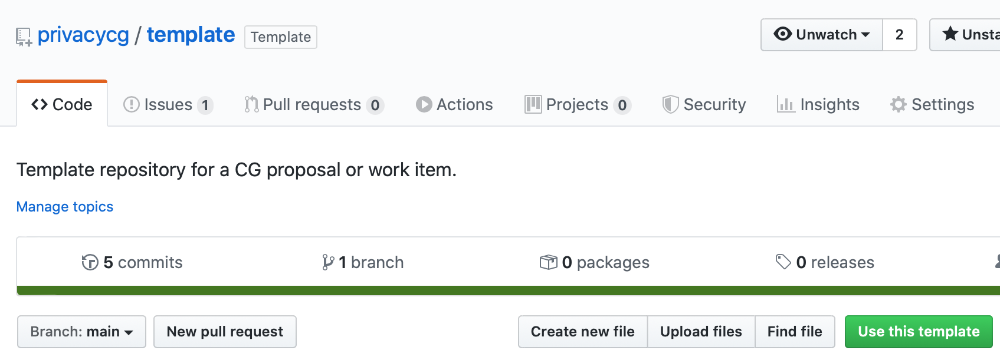
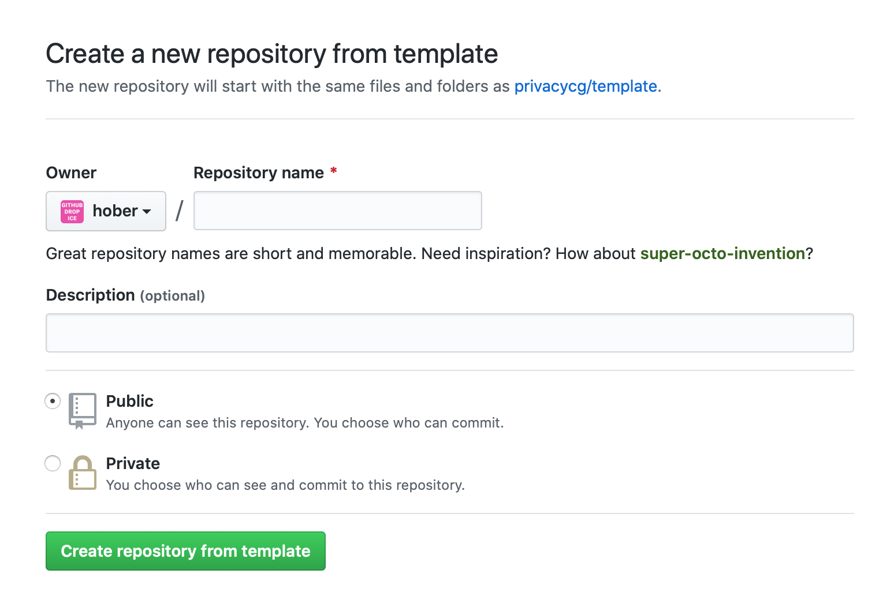

# Guide for Privacy CG chairs

## Git and GitHub

### How to spin up a repo for a new proposal or work item

In order to do this, you'll need to know the following info:

1. A *title* for the proposal or work item.
2. A *shortname* for the proposal or work item. This will be used for the repository name, as well as the shortname in Bikeshed (for work items).
3. A short *description* of the proposal or work item.
4. The *GitHub usernames* of the folks making the proposal or the editors of the work item.
5. **If this is a work item**, you'll also need the following info from each of the editors:
    1. Their *full name*
    2. Their *email address*
    3. Their *affiliation* and *its URL*
    4. Their *w3cid*, which is the number at the end of the url when the editor navigates to https://www.w3.org/users/myprofile

GitHub has a [template repository](https://help.github.com/en/github/creating-cloning-and-archiving-repositories/creating-a-template-repository) feature which we use for spinning up new repositories for work items and proposals.

Our template repo is [privacycg/template](https://github.com/privacycg/template).

To create a new repo from this template, click on its "Use this template" button:

You'll end up on a screen that looks like this:

On this page, you'll need to

1. Change the owner to @privacycg
2. Use the *shortname* for the repository name
3. Provide the *description*
4. Make the repository public

Once you're done, click "Create repository from template".

We how have a repo for the proposal or work item, but you're not done! There are a couple more things to do.

In `Settings -> Manage access`, you'll need configure access rights for the repository:

| Account or Team        | Role |
| ----------------       | ---- |
| privacycg/all          | Read |
| privacycg/contributors | Triage |
| privacycg/chairs       | Maintain |
| privacycg/w3t          | Maintain |
| proposer or editor 1   | Write |
| proposer or editor 2   | Write |
| ..                     | .. |
| proposer or editor N   | Write |

In `README.md`, make these edits:

1. Delete everything above the `# [Title]` line
2. Right after the `# [Title]` line, there are two sentences:

    "A [Proposal](https://privacycg.github.io/charter.html#proposals) of the [Privacy Community Group](https://privacycg.github.io/)."

    "A [Work Item](https://privacycg.github.io/charter.html#work-items) of the [Privacy Community Group](https://privacycg.github.io/)."

    Delete whichever one is not accurate for this proposal or work item.

** If the repo is for a proposal**, you should:

1. delete `work-item.bs` from the repo.

**If the repo is for a work item**, you should:

1. rename `work-item.bs` to `shortname.bs`
2. in `shortname.bs`:
    1. set the `Title`, `Shortname`, `Repository`, `Abstract`, and `URL` fields appropriately
    2. For each editor, modify or add an `Editor` line filled in like so:
`Editor: Full Name, w3cid NNNNN, Affiliation https://affiliation.example/, their@email.example`
3. Uncomment one of the `Status Text` lines. Which one you should choose depends on the nature of the work item.
4. Uncomment one of the `Text Macro: LICENSE` lines. Which one you should choose depends on the nature of the work item.
